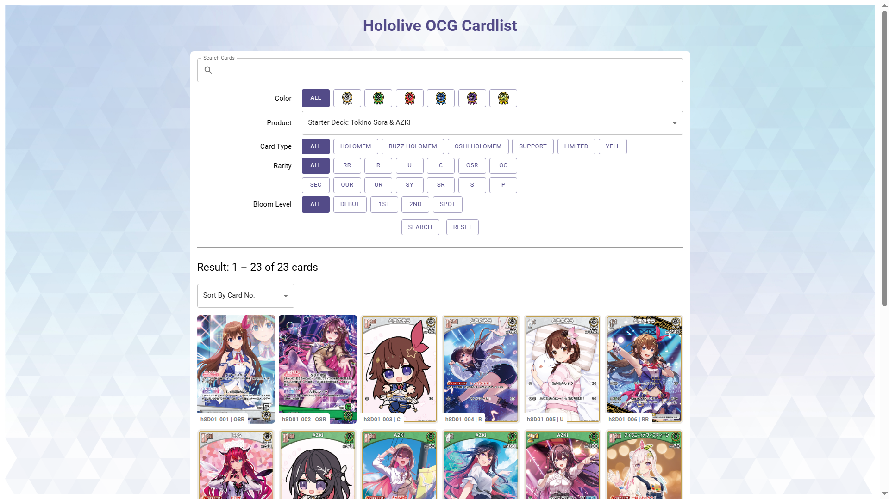

# Hololive OCG Card List

Card listing for Hololive OCG, made with React and Material UI.

Card source: https://hololive-official-cardgame.com/cardlist/

## How to Run

1. `cd client`
2. `npm start ` or `npm run build`

## Rarity Guide

Source: https://www.holocardstrategy.jp/rarity/

- SEC: same art as OUR
- SR: same art as RR and R
- S: same art as U and C

## SR vs R

    

        
        
SR

    

    

        
        
R

    

## UR vs SR vs RR

    

        
        
UR

    

    

        
        
SR

    

    

        
        
RR

    

## SEC vs OUR vs OSR

    

        
        
SEC

    

    

        
        
OUR

    

    

        
        
OSR

    

## Products
- 2024.09.20
    - Starter Yell Set
    - **Booster: Blooming Radiance**
    - Starter Deck: Sora & Azki
- 2024.12.20
    - Starter Deck: Yuzuki Choco
    - Starter Deck: Nekomata Okayu
    - Starter Deck: Nakiri Ayame
    - **Booster: Quintet Spectrum**
- 2025.02.28
    - Starter Deck Yellow: Shiranui Flare
    - Starter Deck Green: Kazama Iroha
    - Starter Deck White: Todoroki Hajime
- 2025.03.21
    - **Booster: Elite Spark**
- 2025.05.02
    - Official Holo card collection -PC Set-
- 2025.06.20
    - **Booster: Curious Universe**